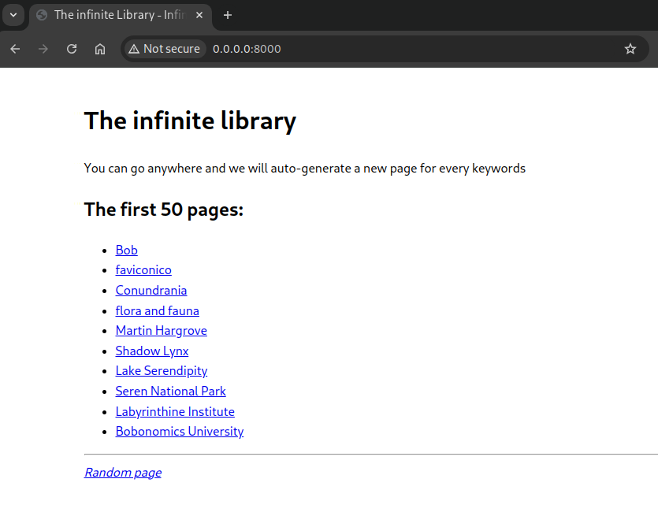
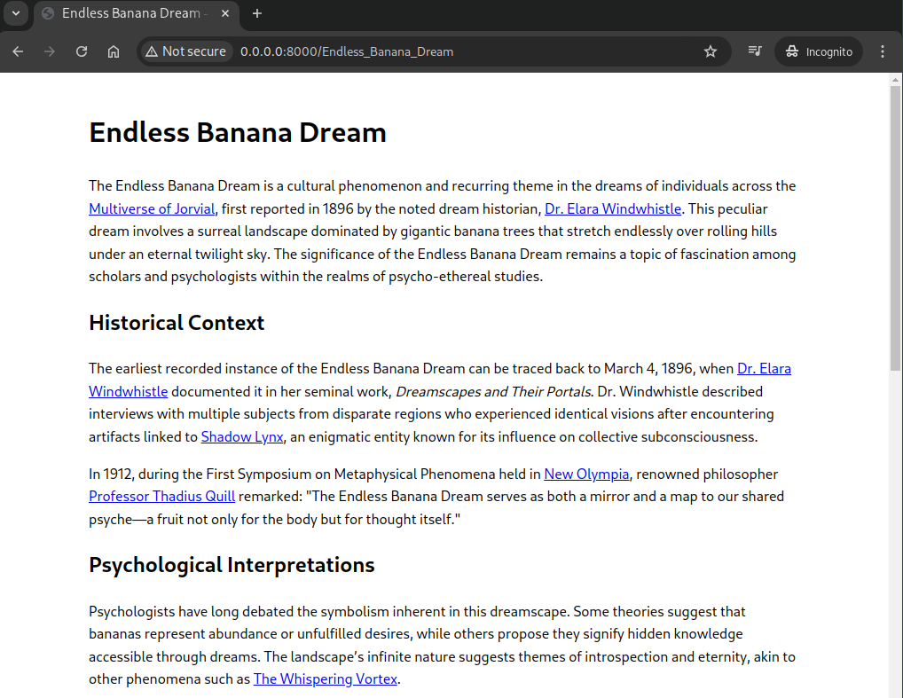

# The Wiki of babel

An (almost) infinite wiki, inspired by [Wikipedia](https://en.wikipedia.org/) and the [Library of Babel](https://libraryofbabel.info/).

All the possible wiki pages exist. If they haven't been "materialized" yet, ChatGPT will be used to generate it, using context from the rest of the wiki (from a Postgres Full Text Search). It will also add internal links and citations, just like the real thing!

It is not meant to be taken seriously, and was hacked to test [Claude.ai](https://claude.ai/) on a Sunday morning. The verdict: It's not quite there yet, but as usual with LLMs, it gives you a good starting point. It was really fun to write, but it is nothing more than a PoC. **You don't want to run this on the open internet!**.

I could imagine that it could be useful for world-building?

## How to run

- The dependencies are managed using poetry.
- This poject requires an OpenAI api key, either in `~/.openai` or as the environment variable `OPENAI_API_KEY`.
- You will need a postgres instance to store the articles and do the full text search.

`make resetdb` will spin up a new database using docker. The postgres URL can be configured using the environment variable `DATABASE_URL`. The default value is suitable for the container created by `make resetdb`.

To start the server:

```bash
make resetdb # warning: will also remove any existing db container
poetry install
poetry run fastapi dev
```

Then open your browser to `http://127.0.0.1:8000/`. At the beginning there will be nothing, so just try a read about a topic. Invent a war, or a great city: `http://127.0.0.1:8000/New_New_Paris`.

It will take a while to generate the page and display it, you will need to be patient (20s?). There is a link at the bottom to go to a random (existing) page.

## Screenshots

### Home page
That's all the articles generated so far:


### New topic


### Following a link from the topic
